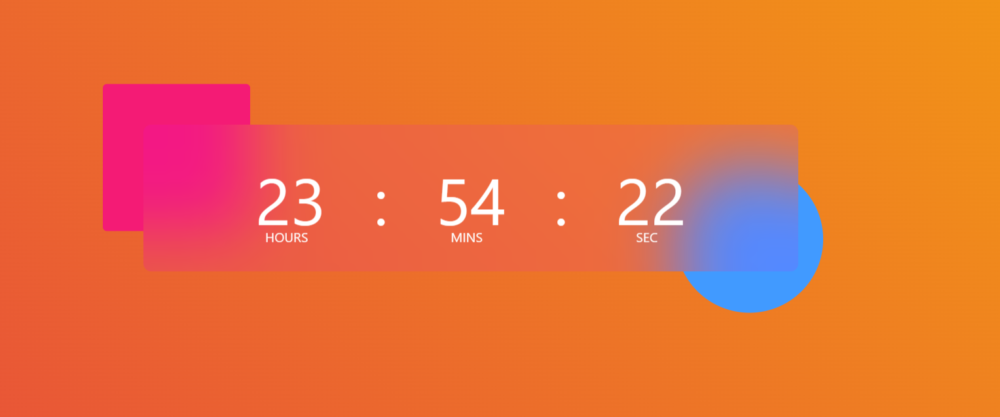

## Digital Clock

This is a simple web-based digital clock that displays the current time in hours, minutes, and seconds. The clock features a visually appealing design with vibrant gradient colors and a modern look.

# Features

    Displays the current time in hours, minutes, and seconds.
    The time is updated every second to reflect the real-time clock.
    Stylish UI with a background gradient and creative visual elements.
    Responsive design for various screen sizes.

# Demo

# Unit Testing

This Digital Clock project includes unit testing to ensure that the clock's functionality works as expected. We have used Mocha, Chai, and Sinon for testing, along with JSDOM for simulating a browser environment in the tests.

## Running Unit Tests

To run the unit tests for this project, follow these steps:

1. Make sure you have Node.js installed on your computer.

2. Install project dependencies by running the following command in your project directory: npm install

3. Run the unit tests using the following command: npm test

This command will execute the tests defined in the `test.js` file using Mocha.

## Test Cases

### 1. Updates DOM elements with current time

- Description: This test ensures that the `myTime` function correctly updates the DOM elements for hours, minutes, and seconds with the current time.
- Expected Result: The DOM elements should display the current time, and the displayed time should match the current time.

### 2. Handles single-digit hours, minutes, and seconds

- Description: This test checks if the `myTime` function handles single-digit hours, minutes, and seconds correctly. It ensures that single-digit values are padded with leading zeros.
- Expected Result: The DOM elements for hours, minutes, and seconds should display the time with leading zeros if the time component is a single digit.

## Test Environment

We have configured the project to use the following testing tools and libraries:

- Mocha: A JavaScript testing framework that provides a test runner and a structure for organizing tests.
- Chai: An assertion library for writing expressive and readable tests. We use Chai's `expect` syntax.
- Sinon: A library for creating spies, mocks, and stubs for testing.

